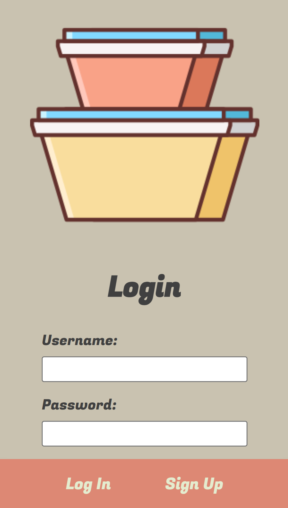
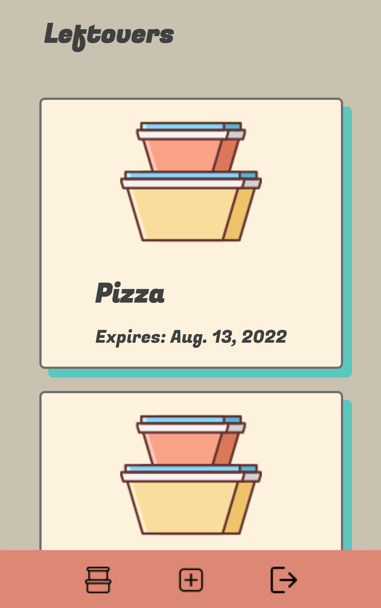
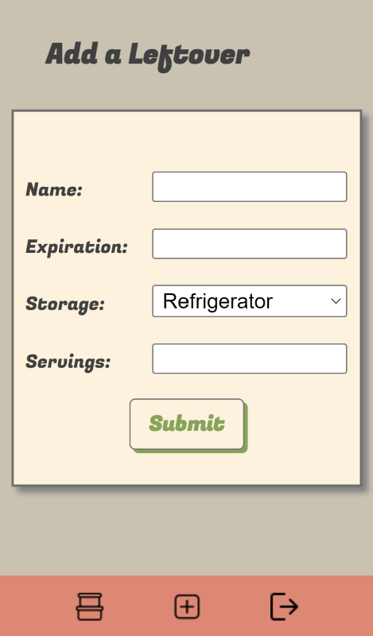
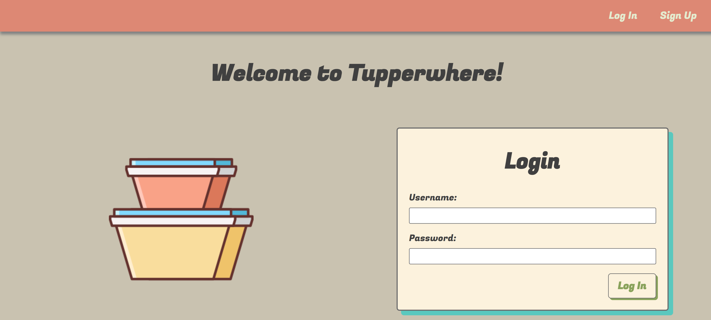
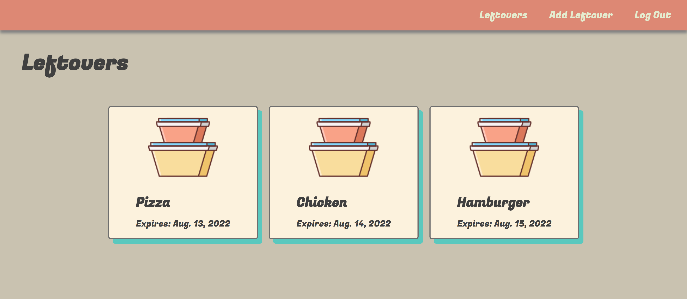
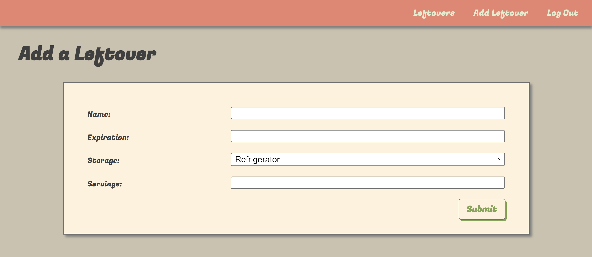

# Tupperwhere

"Where leftovers are never forgotten!"

Tupperwhere is a full CRUD application built with Python, Django, and PostgreSQL. Add your leftover foods and set expiration dates. View your list, and edit and delete items. The app also incorporates responsive design, so it's perfect for use on your smartphone or tablet.

## Getting Started: 
[Launch Tupperwhere](https://tupperwhere.herokuapp.com/)
[Planning materials](https://trello.com/b/nSspOshA/tupperwhere)

## Technologies Used: 
- HTML
- CSS
- JavaScript
- Python
- Django
- PostgreSQL
- Docker
- Heroku

## Screenshots
### Mobile

### Desktop

## Attributions
- [Favicons](https://www.flaticon.com/)

## Next Steps:
- Add a warning message if a leftover is expired
- Prohibit users from inputting dates that have already passed
